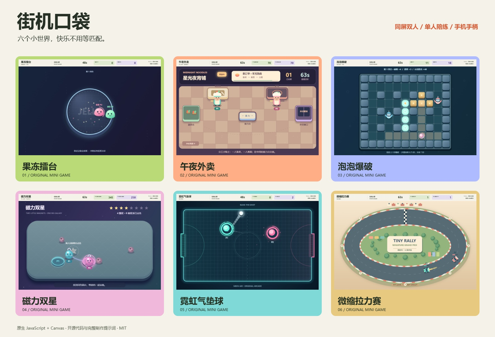
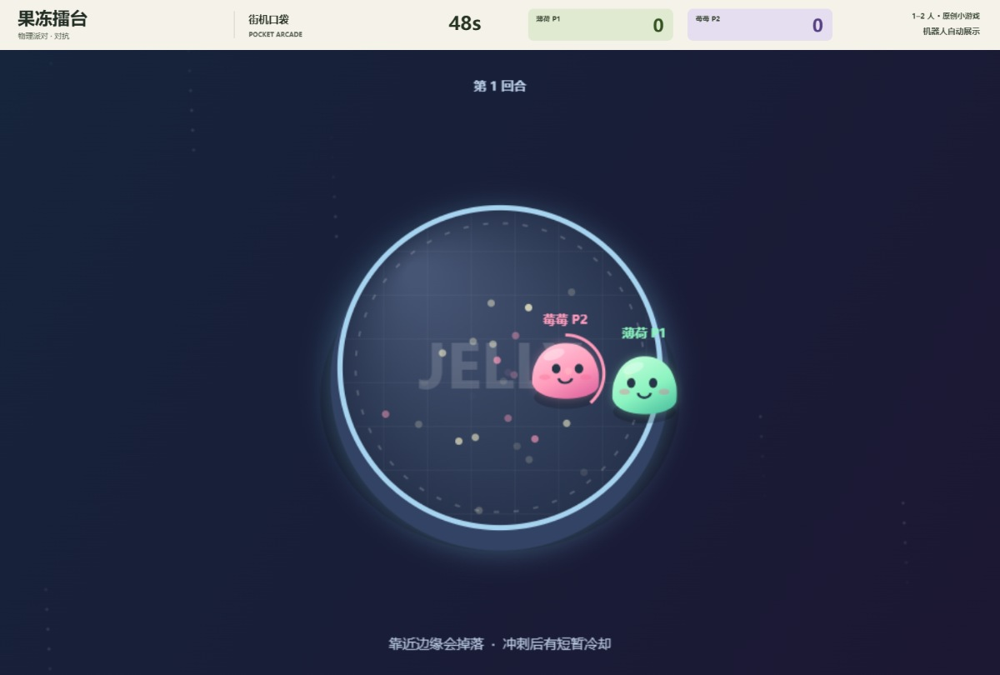
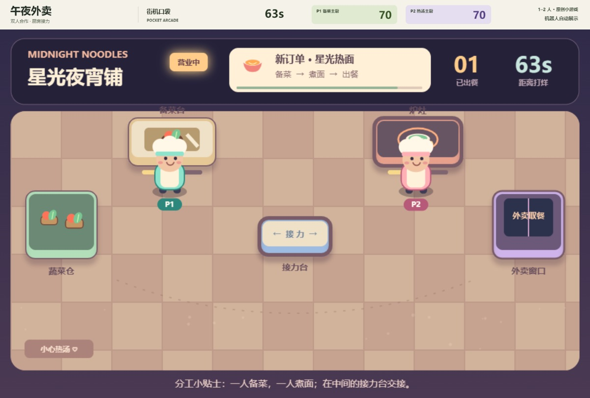
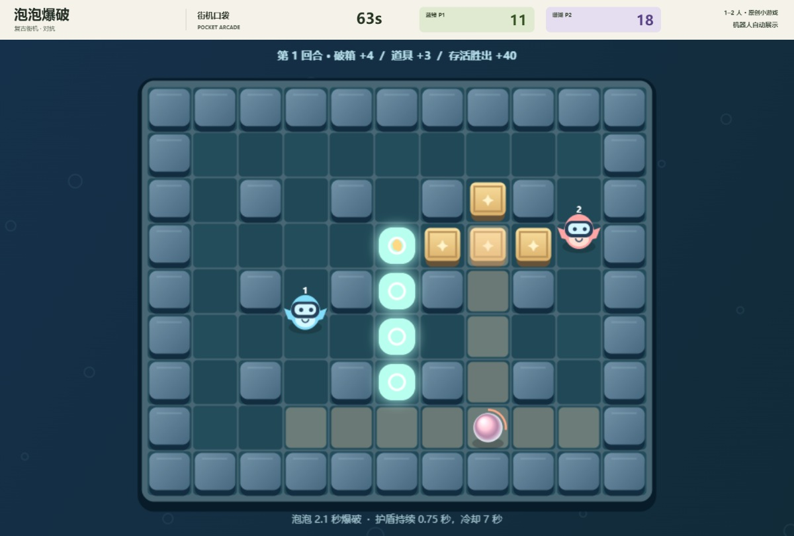
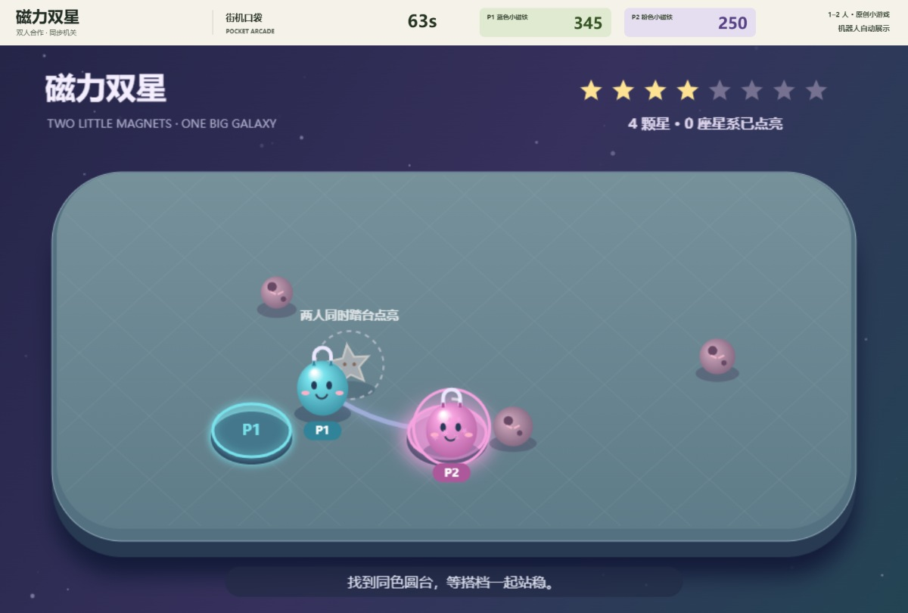
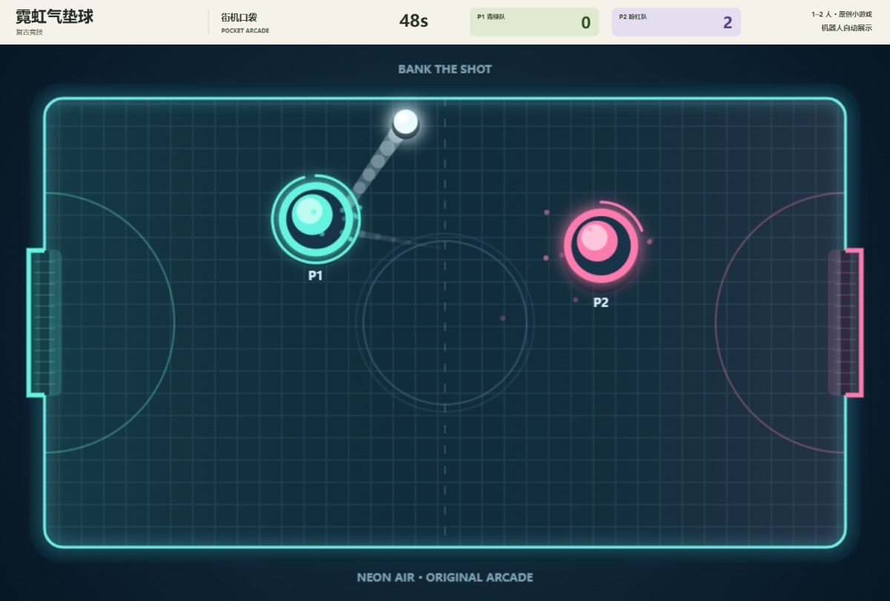
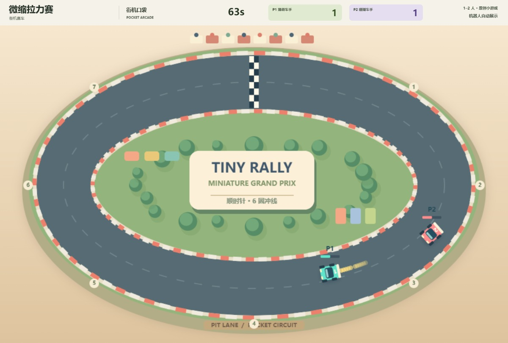

# 街机口袋 · Party Pocket Arcade

**六款原创、开箱即玩的双人浏览器小游戏。** 原生 JavaScript + Canvas，无第三方运行依赖、无账号、无内购。



## 演示视频

[观看 90 秒合集](https://github.com/huoshantao7-hub/party-pocket-arcade/releases/download/v1.0.0/party-pocket-showcase.mp4) · [下载全部 7 个 MP4](https://github.com/huoshantao7-hub/party-pocket-arcade/releases/tag/v1.0.0) · [单款视频与录制说明](docs/videos.md)

连续真实游戏运行，保留机器人演示标注、实时分数与原创同步音效。单款约 47–77 秒。

## 六种朋友局

| 游戏 | 类型 | 每局上限 | 互动亮点 | 说明 / 提示词 |
| --- | --- | --- | --- | --- |
| 果冻擂台 | 对抗 | 60 秒 | 冲刺击退、稳住防守、缩小擂台 | [玩法](docs/jelly.md) |
| 午夜外卖 | 合作 | 75 秒 | 备菜、传菜、烹饪、接力送餐 | [玩法](docs/kitchen.md) |
| 泡泡爆破 | 对抗 | 75 秒 | 连锁爆破、破箱道具、短暂护盾 | [玩法](docs/bubble.md) |
| 磁力双星 | 合作 | 75 秒 | 双人踩台、磁力绳、合作收星 | [玩法](docs/magnet.md) |
| 霓虹气垫球 | 对抗 | 60 秒 / 率先 7 球 | 冲刺击球、边墙反弹、门前救险 | [玩法](docs/hockey.md) |
| 微缩拉力赛 | 竞速 | 75 秒 / 率先 6 圈 | 氮气、刹车、碰撞、有序检查点 | [玩法](docs/racer.md) |

| 果冻擂台 | 午夜外卖 | 泡泡爆破 |
| --- | --- | --- |
|  |  |  |
| **磁力双星** | **霓虹气垫球** | **微缩拉力赛** |
|  |  |  |

## 另外两款独立游戏

这两款各有自己的本地服务和测试，不属于上方六款朋友局大厅；下载仓库后可以分别启动。

| 游戏 | 玩法 | 源码与制作提示词 | 启动 |
| --- | --- | --- | --- |
| 云顶快递 | 三关横版闯关：跳跃、顶砖、踩怪、金币、检查点；键盘和触控 | [项目目录](projects/cloud-courier/) · [制作提示词](projects/cloud-courier/制作提示词.md) | `python -B projects/cloud-courier/launch.py`，打开 `127.0.0.1:8785` |
| 落日靶场 | 移动靶、连击、换弹、限时挑战与同机双人轮流对决 | [项目目录](projects/sunset-range/) · [制作提示词](projects/sunset-range/制作提示词.md) | `python -B projects/sunset-range/launch.py`，打开 `127.0.0.1:8786` |

均需 Python 3.10+；普通游玩不用安装第三方 Python 包。云顶快递的 Laya 模式需自行配置上游源码和模型权重，当前属于实验功能，**没有证明模型能通关**。落日靶场的双人对决是同一设备轮流玩，不是联网对战。
## 一分钟开始

需要 **Node.js 20 或更新版本**，无需 `npm install`。下载或克隆本仓库，进入目录运行：

```sh
node server.mjs
```

打开 **http://127.0.0.1:8770**。Windows 也可以双击 `启动街机口袋.cmd`，启动器会查找已安装的 Node.js、启动服务并打开浏览器。

每款游戏均支持「单人 + 机器人」「同屏双人」「自动展示」。机器人使用普通玩家输入接口，分数由真实游戏规则计算，没有预设赢家。声音默认关闭，可在界面手动开启。

### 键盘与触屏

| 玩家 | 移动 | 主要动作 | 辅助动作 |
| --- | --- | --- | --- |
| P1 | WASD | F | G |
| P2 | 方向键 | K | L |

具体动作随游戏变化，进入游戏后可查看规则。移动端游戏页提供方向与动作按钮；双人共用一块小屏幕时，操作空间会有限。

### 同一 Wi-Fi，手机当手柄

1. 电脑进入游戏，点击「创建双人房间」。
2. 手机与电脑连接同一可信局域网，打开房间显示的局域网链接。
3. 选择 P1 或 P2 加入；电脑显示主画面，手机负责输入。可搭配一个键盘玩家，也可使用两部手机。

本项目提供的是**局域网控制器功能，不是公网联机服务**。HTTP/SSE 独立控制页的加入、按键、释放、离开、关闭流程有自动化测试；**尚未完成实体手机跨 Wi-Fi 验证**。防火墙、路由器访客网络或 AP 隔离可能阻止设备连接。

手机切到后台会释放按键；主机超过 900 毫秒未收到控制更新也会松键。电脑游戏页失去焦点会自动暂停。

### 服务范围

服务默认监听 `0.0.0.0:8770`，以便同一局域网设备连接。仅在自己的电脑和可信局域网运行，**不要直接映射端口或暴露到公网**；项目没有为公网运营设计账号、TLS、持久房间或部署配置。房间及控制凭证仅在服务内存中保存，重启失效。

可用 `PARTY_PORT` 环境变量更改端口。终端启动时按 `Ctrl+C` 停止；Windows 一键启动会在后台运行 Node 服务，可在任务管理器中停止对应的 Node.js 进程。

## 推文与完整制作提示词

启动本地服务后访问 **http://127.0.0.1:8770/docs/publish.html**：一条合集推文、六条单款推文、六份完整提示词均可复制，不会自动发布。

- [推文与提示词 Markdown 汇总](推文与复现提示词.md)
- [可复制文案页面源码](docs/publish.html)
- [浏览器开局指南](docs/README.html)
- [引擎接口说明](docs/engine-contract.md)

修改各游戏的 `docs/<id>.md` 后，可用 Python 3 重新生成文案页面与汇总：

```sh
python build-docs.py
```

提示词用于重新生成同类作品，不保证新的实现逐像素一致；复现本版本请使用仓库源码。

[下一款游戏的玩法与手感制作检查表](docs/game-development-workflow.md)

## 测试与结构

```sh
npm test
```

等效跨平台命令为 `node --test`，它会自动发现 `tests/*.test.mjs`。Bash / CI 也可以显式运行 `node --test tests/*.test.mjs`；Windows 下的 Node.js 20 不会展开该通配符，建议使用 `npm test`。

GitHub Actions 在 Node.js 20 / 22 上执行便携单元测试，无需浏览器、第三方包或密钥。测试覆盖游戏规则、确定性、结束冻结、双人输入以及临时房间通信；测试通过不代表已经测试所有手机硬件或网络环境。

```text
games/               六个独立 Canvas 游戏引擎
shared/              游戏目录、输入与触控组件
play.js              模式、暂停、音效、房间输入
server.mjs           静态文件与临时局域网房间服务
controller.js        手机控制端
docs/                玩法、推文、提示词与浏览器指南
tests/*.test.mjs      Node 原生规则与服务测试
assets/              游戏封面与预览图
```

## English quick start

Six original local multiplayer browser mini-games, built with plain JavaScript and Canvas. Requires **Node.js 20+**; no dependencies to install.

```sh
node server.mjs
# Open http://127.0.0.1:8770
npm test
```

P1: **WASD + F/G**. P2: **arrow keys + K/L**. Play locally with a friend, a rule-based bot, or an explicitly labeled bot showcase. Phones can act as controllers on the same trusted LAN; physical phone/Wi-Fi testing is not yet completed. The server listens on all network interfaces for LAN access and is **not intended for public internet hosting**.

## 许可与创作说明

代码、美术与游戏角色为本项目原创实现，玩法取自常见街机类型；不含原作素材，也不宣称实时热门排名或真实在线人数。参考方向包括[多人协作](https://store.steampowered.com/app/3527290/PEAK/)与[复古竞速](https://www.nintendo.com/us/store/products/f-zero-99-switch/)。

[MIT License](LICENSE) · Copyright © 2026 huoshantao7-hub


## 可选视频生成工具

[tools/video 使用指南](tools/video/README.md) 提供可移机的真实游戏录像、原创合成音效和合集脚本。依赖只安装在视频工具目录，游戏本体仍为零依赖；全部生成物写入被忽略的 `tools/video/output/`。
